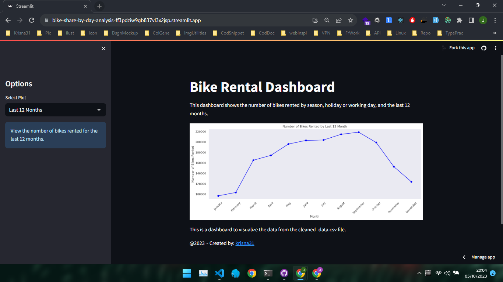

# bike-share-by-day-analysis

## BiReDay Dashboard ✨

[](https://bike-share-by-day-analysis-ff3pdziw9gb837vl3x2jsp.streamlit.app/)

## Live Demo

[](https://bike-share-by-day-analysis-ff3pdziw9gb837vl3x2jsp.streamlit.app/)

## Setup environment

```bash
conda create --name bike-ds python=3.9
conda activate bike-ds
pip install numpy pandas scipy matplotlib seaborn jupyter streamlit babel
```

## Run steamlit app

```bash
streamlit run dashboard/dashboard.py
```
